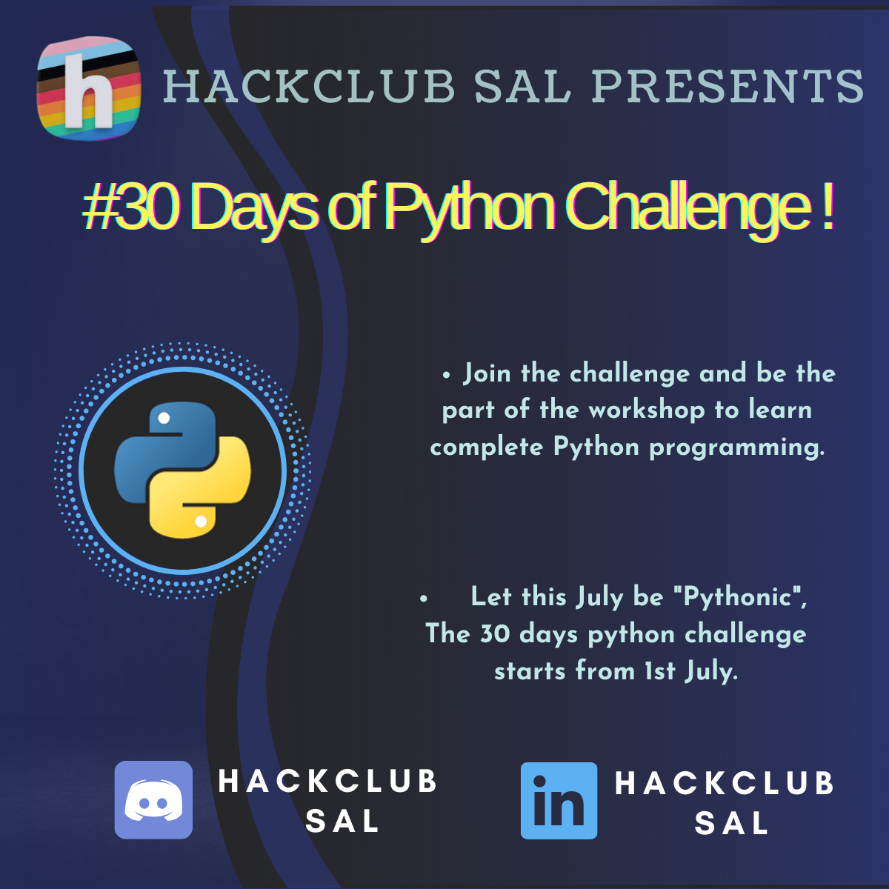

<h1 align="center">30 Days Of Python</h1>

 

<!--

)-->

 Seeing you guys taking interest in coding, and some of you looking for projects to practice, Hackclub SAL is here with its new programme called the <b>30 Days Of Python</b> where you can practice your programming skills through out provided projects based on basic to intermidiate programming.

This July Code Program aims to simplify and guide the way beginners make their first contribution. If you are looking to make your first contribution, follow the steps below.

#### If you don't have git on your machine, [install it](https://help.github.com/articles/set-up-git/).

<h1 align="center">Our Partner</h1>

 

